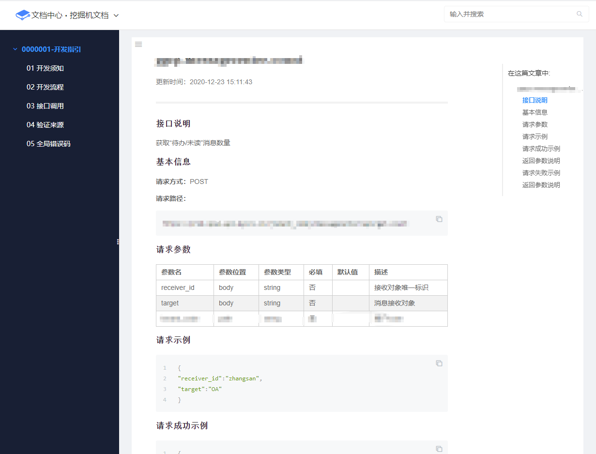
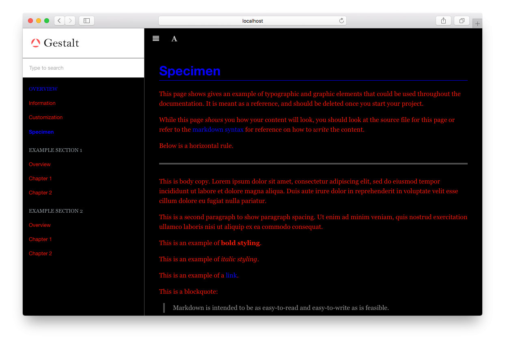

# Gestalt Theme for Gitbook

Gestalt is a theme for [Gitbook](http://www.gitbook.com). While its layout is based off of the [default Gitbook theme](https://github.com/GitbookIO/theme-default), it aims to be highly configurable for styling. This is achieved by porting the default theme styles to SASS and turning most things that were CSS rules into variables.

This theme is for you if the default theme is well enough, but you need more control in how it looks.


## Usage

This theme works with Gitbook version `>= 3.0.0`. To include it in your project, edit your `book.json` to include the theme as a plugin.

```
"plugins": [ "theme-gestalt" ]
```

A recommended usage would be the following:

```
"plugins": [ "theme-gestalt", "-theme-default", "styles-sass-fix" ]
```

This configuration adds the Gestalt theme, removes the default theme, and includes the `styles-sass-fix` plugin to allow you to write your own SCSS to extend the styling. See [Style Customization](#style-customization) for more info.

## Config Options

Below are the theme options available for Gestalt. 

```
"pluginsConfig": {
	"theme-gestalt": {
	    "logo": "/assets/logo.png",			// path to the logo file to use in the sidebar
	    "favicon": "/assets/favicon.png",		// path to your favicon
	    "baseUrl": null,				// sets the base url in the HTML head
	    "excludeDefaultStyles": true,		// excludes the pre-compiled theme css in favor of your custom css
	    "doNotHideChildrenChapters" : false		// in summary, disables hiding of child chapters for inactive chapter
	}
}
```

## Style Customization

Customizing the style of Gestalt is possible by creating a SCSS file in your project that includes Gestalt's SCSS but overwrites its variables. But first, we'll need to do some setup.

### Setup

To customize the style of Gestalt, you must first do the following:

#### Exclude the Default Theme CSS

By default, Gitbook themes inject a CSS file into your project. However, we want to include _your_ customized CSS file into the project instead. To achieve this, edit your `book.json` file to include the following: 

```
"pluginsConfig": {
	"theme-gestalt": {
	    "excludeDefaultStyles": true
	}
}
```

#### Include the Styles-Sass plugin

In order to compile your custom SCSS, you'll need to include the [styles-sass-fix](https://github.com/Nasicus/plugin-styles-sass) plugin:

```
"plugins": [ "theme-gestalt", "-theme-default", "styles-sass-fix" ]
```

### Customizing

Now that you're all setup, you'll need to include your custom SCSS file in your project. Edit your `book.json` to include your custom SCSS file:

```
"styles": {
    "website": "./styles/website.scss"
}
```

Now we get to the actual customization. In your custom SCSS file, overwrite the variables you need to achieve your look. Higher level variables can be found in [_variables.scss](./src/scss/_variables.scss), while more specific variables can found in the tops of the files in [./src/scss/website](./src/scss/website).

Here's an example custom SCSS file:

```SASS
@import "../node_modules/gitbook-plugin-theme-gestalt/src/scss/variables";

// Put your variable overrides here
$book-background: black;
$page-background: black;
$sidebar-background: black;
$color-border: $color-gray-dark;

$color-primary: blue;
$color-text: red;

$heading-map : ( 
				color: $color-primary, 
				border-bottom: 1px solid $color-primary,
				font-family: $font-family-sans
				);

@import "../node_modules/gitbook-plugin-theme-gestalt/src/scss/all";
```

The above would then produce the following:




